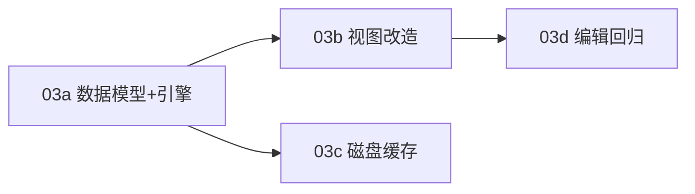

# REQ-2.0-03 剪映式虚拟时间线音频轨道波形展示

## 版本：V2.0 | 优先级：P0 | 状态：⬜ 待开发（已拆解）

> 来源：2026-05-20 用户反馈 + 超大录音波形无响应问题复盘 + 剪映类时间线方案分析  
> 当前问题：1 小时以上、GB 级录音在编辑器轨道中仍不能依赖"整段音频全量解码 + 全局压缩波形数组"的显示模型；后续轨道需要支持左右滑动、缩放，必须改为视口驱动的虚拟时间线波形架构。

---

## ⚡ 需求拆解

本需求已拆解为 4 个可独立验收的子需求单，建议按依赖顺序执行：

| 子需求 | 标题 | 优先级 | 预估 | 依赖 |
|--------|------|--------|------|------|
| [REQ-2.0-03a](REQ-2.0-03a.md) | 数据模型 + Tile 引擎 | P0 | 1d | 无 |
| [REQ-2.0-03b](REQ-2.0-03b.md) | 视图改造 + 绘制迁移 | P0 | 1d | 03a |
| [REQ-2.0-03c](REQ-2.0-03c.md) | 磁盘缓存 + 二次打开加速 | P1 | 0.5d | 03a |
| [REQ-2.0-03d](REQ-2.0-03d.md) | 编辑回归 + 模型预留 | P2 | 0.5d | 03b |

**执行顺序：** 03a → 03b → 03c / 03d（03c 和 03d 可并行）



---

## 1. 一句话需求
将编辑器音频轨道改造成 **剪映式虚拟时间线波形展示**：根据当前可见时间范围和缩放级别按需加载波形瓦片，使用多级 LOD 缓存，只绘制屏幕可见范围，避免大文件无响应，并支持左右滑动和缩放下的稳定显示。

---

## 2. 问题定义

当前音频轨道波形展示存在以下问题：

| 问题 | 当前表现 | 用户影响 |
|---|---|---|
| 大文件加载风险 | 1 小时以上 / GB 级录音容易卡在加载波形或编辑器入口 | 用户认为 App 无响应，无法处理长录音 |
| 数据模型不适合缩放 | 编辑器波形依赖整段音频压缩后的全局 `allSamples` | 放大后波形不够清晰，局部编辑缺少可信细节 |
| 数据模型不适合横向滑动 | 全局数组按比例取样，和视口滚动耦合弱 | 滚动到中间区域仍依赖整段预处理结果 |
| 粗到细替换体验不适合轨道 | 如果先画粗波形再替换细波形，轨道会出现形状跳变 | 用户会误判声音位置和剪辑点 |
| 波形显示与音频编辑耦合 | 展示波形可能触发完整 PCM 加载 | 仅查看轨道也可能消耗大量内存 |
| 后续多轨扩展受限 | 当前单数组模型难以支持 clip、静音段、标记、局部缓存 | 多轨、裁剪、淡入淡出等能力难扩展 |

---

## 3. 产品原则

1. **轨道是时间线，不是一张整段图片。** 逻辑时间线可以很长，但屏幕只绘制当前视口。
2. **波形显示数据不等于音频数据。** 波形抽样、LOD、缓存只服务 UI，不改变原始录音音质。
3. **当前视口需要什么精度，就加载什么精度。** 不为屏幕外区域阻塞当前显示。
4. **缩放和滚动必须驱动数据请求。** 视口变化后重新计算需要的 tile 和 LOD。
5. **精细编辑场景不拿粗波形冒充最终波形。** 目标 LOD 未就绪时显示骨架或低置信度 fallback，避免明显波形跳变。
6. **播放头、选区、静音段、剪辑标记是 overlay。** 不写入波形数据本身。
7. **长音频优先保证可操作。** 允许局部区域短暂显示占位，但不允许 App 无响应。

---

## 4. 目标用户故事

### US-01：打开长录音

> 作为录制了 1 小时以上会议 / 课程音频的用户，我想打开录音后编辑器不要卡死，并能看到轨道概览，以便快速判断录音是否可用。

### US-02：左右滑动定位

> 作为处理长录音的用户，我想在时间线上左右滑动到任意时间段，并看到该视口范围内的波形，以便定位需要剪辑的位置。

### US-03：缩放查看细节

> 作为需要精细剪辑的用户，我想放大某个时间段后看到更高精度的波形，而不是被整段压缩过的模糊波形误导。

### US-04：避免粗到细跳变

> 作为在轨道上查找剪辑点的用户，我不希望同一区域的波形从粗略形状突然变成另一种精细形状，以免误判声音位置。

### US-05：二次打开加速

> 作为反复处理同一录音的用户，我希望第二次打开长录音时波形能够更快显示，以便继续编辑而不用重新等待扫描。

---

## 5. 目标方案

### 5.1 核心模型

```text
AudioAsset
  ↓
WaveformTileProvider
  ├─ TimelineViewport
  ├─ LOD 选择
  ├─ 内存缓存
  ├─ 磁盘缓存
  ├─ 后台 tile 生成
  └─ 取消过期请求
  ↓
EditorWaveformView
  ├─ drawRuler
  ├─ drawWaveformTiles
  ├─ drawSelectionOverlay
  ├─ drawMarkers
  └─ drawPlayhead
```

### 5.2 时间线视口

编辑器必须显式维护当前可见范围：

```swift
struct TimelineViewport {
    var visibleStartTime: TimeInterval
    var visibleDuration: TimeInterval
    var pixelsPerSecond: CGFloat
    var zoomLevel: CGFloat

    var visibleEndTime: TimeInterval {
        visibleStartTime + visibleDuration
    }
}
```

要求：

- `visibleStartTime` 表示屏幕左侧对应的时间。
- `visibleDuration` 表示当前屏幕宽度覆盖的时间长度。
- `pixelsPerSecond` 由视口宽度和 `visibleDuration` 计算。
- `zoomLevel` 只影响视口，不直接决定波形数组下标。

### 5.3 音频素材

```swift
struct AudioAsset {
    let id: String
    let url: URL
    let duration: TimeInterval
    let sampleRate: Double
    let channelCount: Int
    let fileSize: Int64
    let modifiedAt: Date
}
```

要求：

- `id` 必须稳定，可由文件路径、大小、修改时间、算法版本共同生成。
- 缓存必须能根据文件大小或修改时间变化自动失效。
- 不得仅以文件名作为缓存 key。

### 5.4 波形瓦片

```swift
struct WaveformTileKey: Hashable {
    let assetID: String
    let lodLevel: Int
    let tileIndex: Int
}

struct WaveformPeak {
    let min: Float
    let max: Float
    let rms: Float?
}

struct WaveformTile {
    let key: WaveformTileKey
    let sourceStartTime: TimeInterval
    let duration: TimeInterval
    let samplesPerPeak: Int
    let peaks: [WaveformPeak]
}
```

要求：

- 每个 `WaveformTile` 必须有真实时间范围。
- 每个 peak 应优先保存 `min` / `max`，不能只保存 `abs(sample)`。
- `rms` 可选，用于后续响度感知或静音辅助显示。
- 绘制时必须通过时间映射到 x 坐标，而不是通过全局数组比例映射。

---

## 6. LOD 规则

### 6.1 LOD 选择

根据 `pixelsPerSecond` 选择波形精度：

| 场景 | `pixelsPerSecond` | 推荐 LOD | 数据密度 |
|---|---:|---:|---|
| 整段 1 小时预览 | `< 1` | `0` | 每 5-10 秒一个 peak |
| 几十分钟视图 | `1 ~ 5` | `1` | 每秒 1-2 个 peak |
| 几分钟视图 | `5 ~ 30` | `2` | 每秒 10 个 peak |
| 几十秒视图 | `30 ~ 150` | `3` | 每秒 50 个 peak |
| 秒级编辑 | `> 150` | `4` | 每秒 100-300 个 peak |

### 6.2 tile 时间长度

| LOD | 建议 tile 时长 | 说明 |
|---:|---:|---|
| 0 | 300s | 全局概览，数据量小 |
| 1 | 120s | 长时间范围浏览 |
| 2 | 60s | 常规编辑浏览 |
| 3 | 30s | 精细定位 |
| 4 | 10s | 秒级细节编辑 |

要求：

- tile 按时间切分，不按像素切分。
- 高 LOD 的 tile 时长更短，避免单个 tile 数据过大。
- 不同 LOD 可独立缓存和失效。

---

## 7. 交互要求

### 7.1 打开文件

打开文件后：

1. 初始化 `AudioAsset`。
2. 初始化 `TimelineViewport`。
3. Fit All 时选择适合整段视图的 LOD。
4. 请求当前视口需要的 tiles。
5. 视口外区域不阻塞当前显示。

### 7.2 左右滑动

用户左右滑动时：

```text
scroll delta pixels
  ↓
deltaTime = deltaPixels / pixelsPerSecond
  ↓
visibleStartTime += deltaTime
  ↓
requestVisibleTiles()
```

要求：

- 横向滑动基于 `pixelsPerSecond`，不得基于总时长比例。
- 滑动后必须请求当前视口 tiles。
- 需要增加预取范围，建议左右各预取 `visibleDuration * 0.5`。
- 用户快速滑动时，旧请求必须可取消或降级优先级。

### 7.3 缩放

用户缩放时：

```text
anchorX
  ↓
anchorTime = pixelToTime(anchorX)
  ↓
更新 visibleDuration / pixelsPerSecond
  ↓
保持 anchorTime 在缩放前后仍位于鼠标位置
  ↓
重新选择 LOD
  ↓
requestVisibleTiles()
```

要求：

- 缩放必须锚定鼠标所在时间点。
- 缩放后播放头、选区、标记位置不能漂移。
- 缩放可能导致 LOD 切换，必须重新请求目标 LOD tiles。
- 不得因为缩放而重新处理整段音频。

### 7.4 未加载区域显示

| 场景 | 显示要求 |
|---|---|
| 目标 LOD 已加载 | 正常绘制 |
| 目标 LOD 未加载，但低 LOD 有缓存 | 可淡化显示，必须表现为低置信度 fallback |
| 无任何可用 tile | 显示低调 skeleton / loading stripe |
| 当前视口 tile 正在生成 | 不阻塞滚动和缩放 |
| 生成失败 | 当前 tile 显示失败占位，不影响其他 tile |

要求：

- 中高缩放下不允许粗波形直接冒充最终波形。
- tile 完成后只刷新相关区域或当前视口，不重建整个编辑器。

---

## 8. 缓存要求

### 8.1 内存缓存

- 使用 LRU 或 `NSCache` 管理当前会话 tiles。
- 优先保留当前视口、播放头附近、最近访问过的 tiles。
- 建议内存预算：`50-200MB`，具体由架构评审确定。

### 8.2 磁盘缓存

缓存路径建议：

```text
~/Library/Caches/AudioRecord/Waveforms/
```

缓存 key 必须包含：

- 文件路径 hash
- 文件大小
- 修改时间
- sampleRate
- channelCount
- waveform algorithm version
- lodLevel
- tileIndex

要求：

- 同一录音第二次打开时优先读取磁盘缓存。
- 文件变化后旧缓存自动失效。
- 算法版本变化后旧缓存自动失效。
- 磁盘缓存失败不得影响音频播放和编辑。

---

## 9. 后台任务要求

### 9.1 优先级

后台生成 tile 的优先级：

1. 当前视口内 tiles。
2. 播放头附近 tiles。
3. 视口左右预取 tiles。
4. Fit All / overview tiles。
5. 其他低优先级缓存补全。

### 9.2 取消策略

必须支持以下取消场景：

- 用户切换文件。
- 用户关闭编辑器。
- 用户快速滚动到远处。
- 用户缩放导致 LOD 变化。
- 文件被删除或不可访问。

取消后旧任务不得覆盖新视口的显示结果。

---

## 10. 功能范围

### In Scope

- 新增 `WaveformTileProvider` 或等价数据层。
- 新增 `WaveformTile`、`WaveformPeak`、`WaveformTileKey` 等模型。
- 将 `EditorWaveformView` 从全局 `allSamples` 模型迁移到 visible tiles 模型。
- 根据 `visibleStartTime`、`visibleDuration`、`pixelsPerSecond` 请求当前视口 tiles。
- 支持 LOD 选择。
- 支持当前视口绘制、左右滑动、缩放下的 tile 请求。
- 支持内存缓存。
- 支持磁盘缓存，至少完成缓存 key、读写、失效机制。
- 支持 tile 加载占位、低置信度 fallback、失败占位。
- 波形生成必须基于分段读取，不得为了显示整段全量加载 PCM。
- 播放头、选区、静音段、剪辑点作为 overlay 绘制。

### Not in Scope

- 不改变原始音频文件采样率、码率或音质。
- 不实现多轨混音引擎。
- 不实现完整非破坏式编辑引擎。
- 不实现导出渲染管线重构。
- 不实现转文字、智能静音检测算法。
- 不重写主窗口录制态 UI。
- 不要求做到 sample-level 编辑精度；秒级 / 亚秒级可视化精度先满足 MVP。

---

## 11. 受影响文件预估

| 文件 | 预期改动 |
|---|---|
| `AudioRecordApp/Sources/Views/Editor/EditorWaveformView.swift` | 从 `allSamples` 绘制迁移到 visible tiles 绘制；滚动/缩放后请求 tiles |
| `AudioRecordApp/Sources/Editor/EditorViewController.swift` | 初始化 `AudioAsset` / provider；避免为波形展示全量加载 `AVAudioPCMBuffer` |
| `AudioRecordApp/Sources/Editor/WaveformTileProvider.swift` | 新增：tile 请求、LOD 选择、缓存、后台生成、取消 |
| `AudioRecordApp/Sources/Editor/WaveformTile.swift` | 新增：tile key、peak、tile 数据模型 |
| `AudioRecordApp/Sources/Editor/WaveformDiskCache.swift` | 新增或内聚到 provider：磁盘缓存读写与失效 |
| `AudioRecordApp/Sources/Editor/TimelineViewport.swift` | 新增或内聚到 view：视口模型 |
| `AudioRecordApp/Sources/Editor/EditCommand.swift` | 暂不重构；仅确保现有全量编辑命令不阻塞波形展示路径 |

---

## 12. 验收标准

### 12.1 大文件打开

- [ ] 打开 1 小时以上录音，App 不无响应。
- [ ] 打开 1GB 级录音，编辑器不因为波形展示全量分配 PCM。
- [ ] 首屏可在可接受时间内显示 Fit All 概览或占位。
- [ ] 波形加载失败不会导致编辑器崩溃。

### 12.2 左右滑动

- [ ] 用户可在长录音轨道上左右滑动。
- [ ] 滑动到任意时间段后，当前视口能请求并显示对应 tiles。
- [ ] 快速滑动时旧请求不会覆盖新视口。
- [ ] 视口外 tile 生成不会阻塞当前滚动。

### 12.3 缩放

- [ ] 缩放以鼠标位置为 anchor。
- [ ] 缩放后鼠标下的时间点保持稳定。
- [ ] 缩放后根据 `pixelsPerSecond` 自动切换 LOD。
- [ ] 放大到几十秒 / 秒级视图时，不继续使用整段低精度 `allSamples`。
- [ ] 缩放过程播放头、选区、标记不漂移。

### 12.4 波形绘制

- [ ] `EditorWaveformView` 不再依赖单一全局 `allSamples` 作为唯一数据源。
- [ ] 每个 peak 按真实时间映射到 x 坐标。
- [ ] 波形使用 `min` / `max` 绘制上下振幅。
- [ ] 目标 LOD 未加载时显示 skeleton 或低置信度 fallback。
- [ ] tile 完成后只更新相关显示，不造成整页闪烁。

### 12.5 缓存

- [ ] 当前会话内重复滚动到同一区域优先命中内存缓存。
- [ ] 第二次打开同一文件优先命中磁盘缓存。
- [ ] 文件大小或修改时间变化后旧缓存失效。
- [ ] 算法版本变化后旧缓存失效。
- [ ] 缓存读写失败不影响音频播放。

### 12.6 音质与编辑安全

- [ ] 波形抽样不修改原始音频文件。
- [ ] 播放链路不使用低精度波形数据替代音频数据。
- [ ] 导出链路不使用低精度波形数据替代音频数据。
- [ ] 现有短音频编辑能力不回退。

### 12.7 回归

- [ ] 短录音仍能正常显示完整波形。
- [ ] 播放头显示和 seek 正常。
- [ ] 选区拖拽仍正常。
- [ ] 静音段 / 裁剪标记叠加不受影响。
- [ ] 编译通过。

---

## 13. MVP 拆分建议

### MVP-1：视口驱动 + 内存 tile

- 新增 tile 模型。
- `EditorWaveformView` 绘制 visible tiles。
- 支持 LOD 选择。
- 支持滚动 / 缩放后请求当前视口。
- 支持内存缓存和取消过期请求。

### MVP-2：磁盘缓存

- 增加缓存 key。
- 增加磁盘读写。
- 增加缓存失效。
- 第二次打开同一长录音时加速。

### MVP-3：编辑模型预留

- 引入 `AudioClip` / `TimelineModel` 概念。
- 将播放头、选区、标记统一作为 timeline overlay。
- 为后续非破坏式编辑预留接口。

---

## 14. 优先级与排期

| 项目 | 值 |
|---|---|
| 优先级 | P0 |
| 插队原因 | 长录音是录音工具核心场景；当前全量波形模型会阻断 1 小时以上录音的查看和编辑 |
| 建议排期 | 在继续推进复杂编辑器 / 多轨 UI 前完成 |
| 预估开发 | 2-3 天 |
| 预估 QA | 1 天 |
| 风险等级 | 高：涉及编辑器波形数据层、滚动缩放、缓存与异步取消 |

---

## 15. 依赖

- REQ-2.0-01（轨道 + 轨道板模式 UI 重构）
- REQ-2.0-02（启动默认录制准备态 UI 重构）
- 当前 `EditorWaveformView` 已有的 `visibleStartTime` / `visibleDuration` / `zoomLevel` / `timeToPixel` / `pixelToTime` 视口基础

---

## 16. 下游建议

### 给矩（架构）

重点审查：

- `WaveformTileProvider` 边界是否清晰。
- `TimelineViewport` 应属于 view、controller 还是 timeline model。
- LOD / tile cache 的算法版本和失效策略。
- 波形展示路径如何与全量 PCM 编辑路径解耦。

### 给绘（设计）

需要定义：

- tile 未加载时的 skeleton 样式。
- 低置信度 fallback 的视觉弱化方式。
- 高缩放状态下波形柱 / 上下振幅的视觉规范。
- 当前视口、播放头、选区、静音段 overlay 的层级。

### 给铸（开发）

实现顺序建议：

1. 先新增数据模型和 provider。
2. 再迁移 `EditorWaveformView` 绘制。
3. 再接入滚动 / 缩放触发请求。
4. 最后接入磁盘缓存。

不要在本需求中顺手重构导出、编辑命令或多轨混音。

### 给鉴（QA）

重点测试：

- 5 分钟、30 分钟、1 小时、1GB+ 文件。
- 快速左右滑动。
- 连续缩放。
- 缩放时播放头和选区稳定性。
- 切换文件后旧波形任务是否污染新文件。
- 二次打开缓存命中。