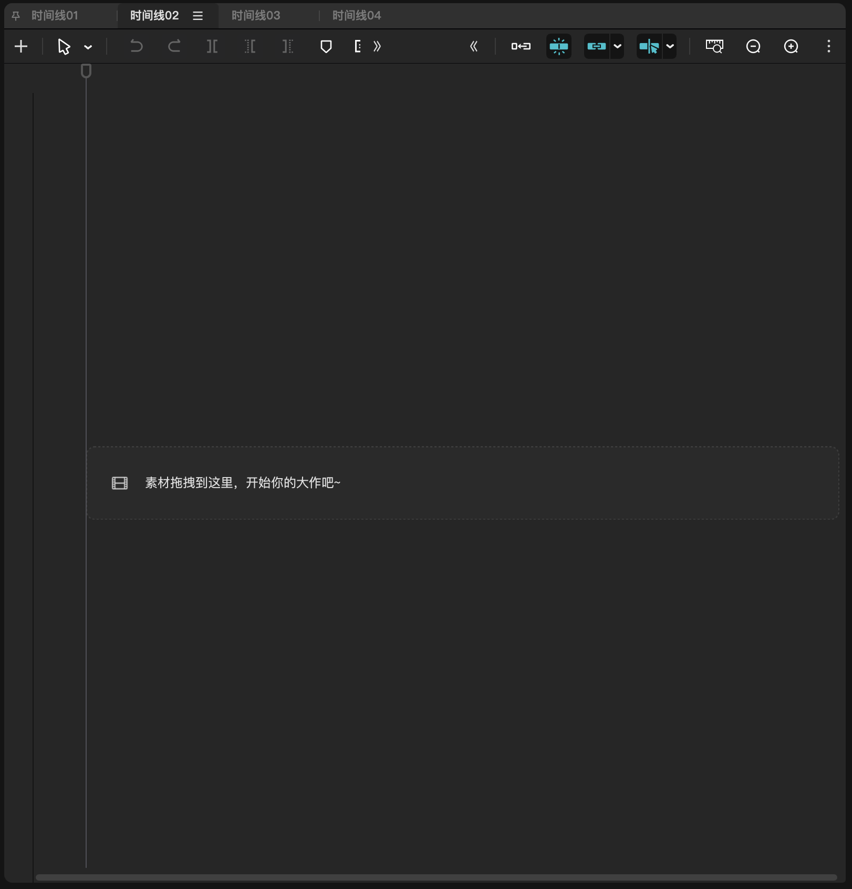
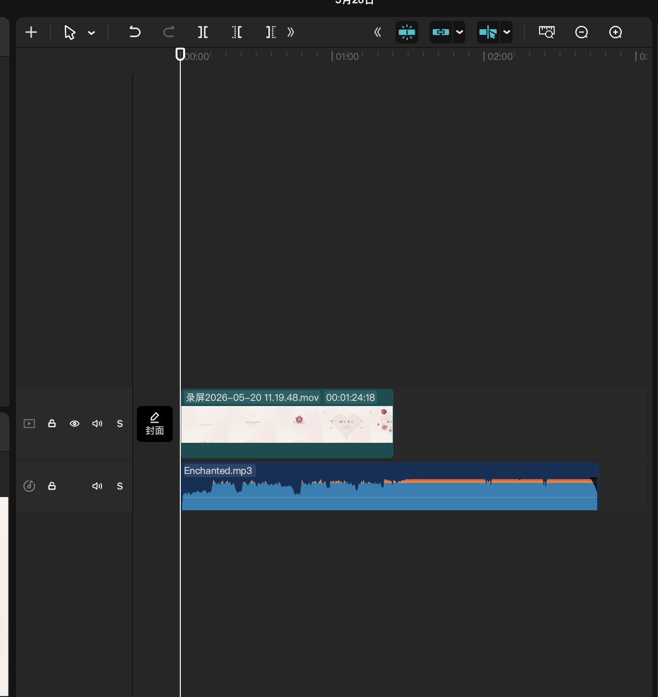
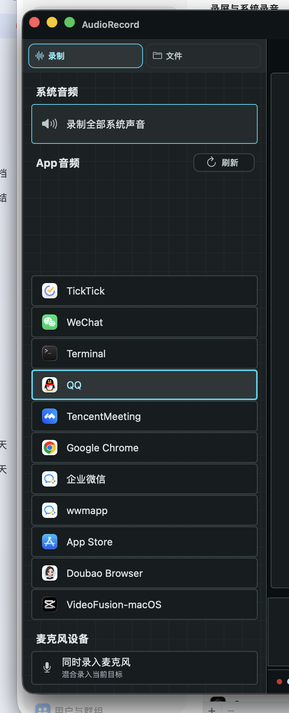
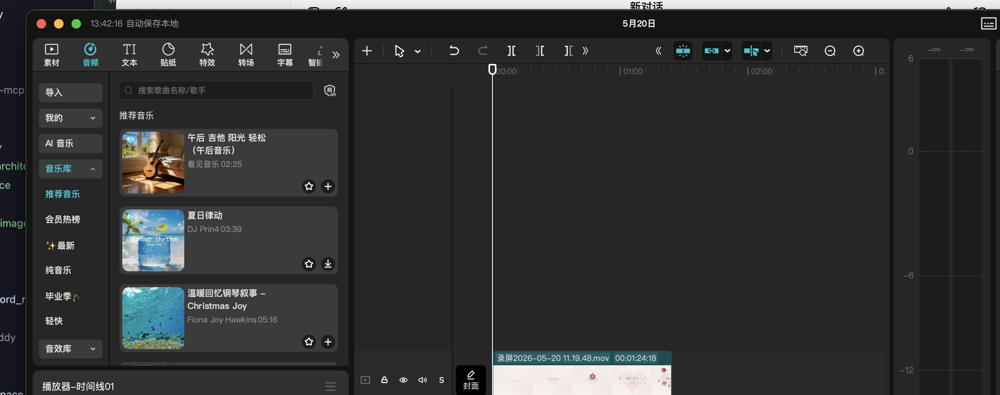
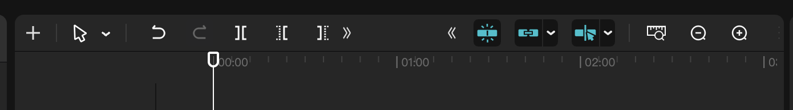

1、UI 优化，优化编辑区域的轨道录音，采用剪映轨道显示，可以支持多个轨道，轨道居中，上下不要顶满，给其他轨道预留空间，虽然现在只支持 1 个轨道。轨道左边是轨道头，支持的功能。

参考：

2、左边程序列表，往下拉，会有留白

3、卡片布局：整体左边 ，右边均做成卡片布局。注意底色和卡盘的颜色。全局设计统一风格。

4、参考剪映，bar 是一个整体，然后跟下面的轨道区域有分割线，顶bar 卡片有圆角。

